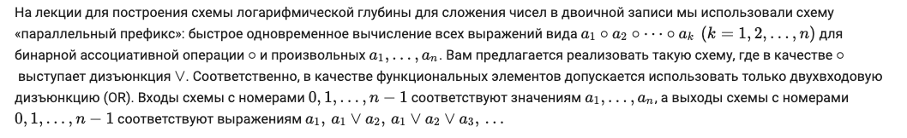
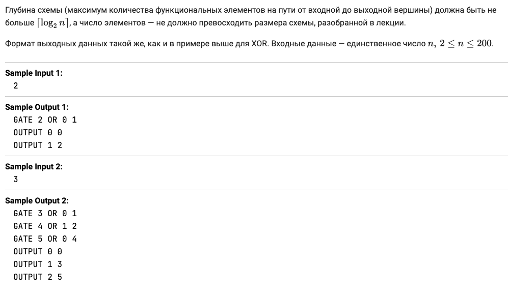

# Задание 1: параллельное вычисление префиксов «произведения»

## Как мы будем описывать схемы из функциональных элементов

Схема — это ациклический орграф, в котором каждая вершина является либо входом, либо функциональным элементом; некоторые вершины также могут дополнительно быть помечены как выходные. Схему нужно вывести в стандартный поток вывода в виде последовательности строк, каждая из которых имеет либо вид

```
GATE <номер вершины> <AND|OR|NOT> <номера вершин, выходы которых поданы на элемент>
```

или

```
OUTPUT <порядковый номер выхода> <номера вершины граф схемы, с которой снимается выходное значение>
```

Вершины нумеруются, начиная с нулевой. Если схема реализует функцию (или набор функций) от nn переменных, то вершины с наименьшими nn номерами считаются входами, и им не должны приписываться функциональные элементы. Номера вершин схемы должны образовывать непрерывный интервал натуральных чисел. Выходы схемы имеют порядковые номера, начинающиеся с нулевого и также образующие непрерывный интервал натуральных чисел.

Пример описания схемы, имеющей два входа и один выход, в котором реализуется операция XOR от двух переменных (функция XOR реализована в вершине с номером 5):

```
GATE 2 AND 0 1
GATE 3 OR 0 1
GATE 4 NOT 2
GATE 5 AND 3 4
OUTPUT 0 5
```

## Описание задания



## Ограничения на размер и глубину


