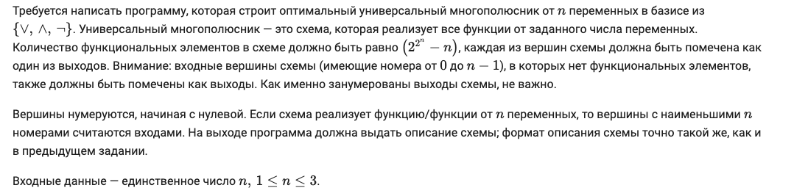

# Задание 3: Универсальный многополюсник

## Описание задания

## Входные ограничения

Задание полностью совпадает с предыдущим, разница лишь в том, что теперь Ваша программа должна корректно работать при `1 ≤ n ≤ 4`.
